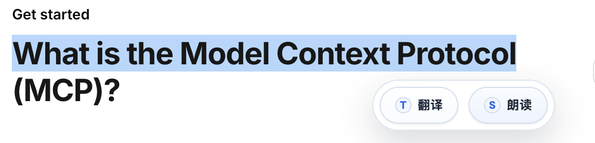
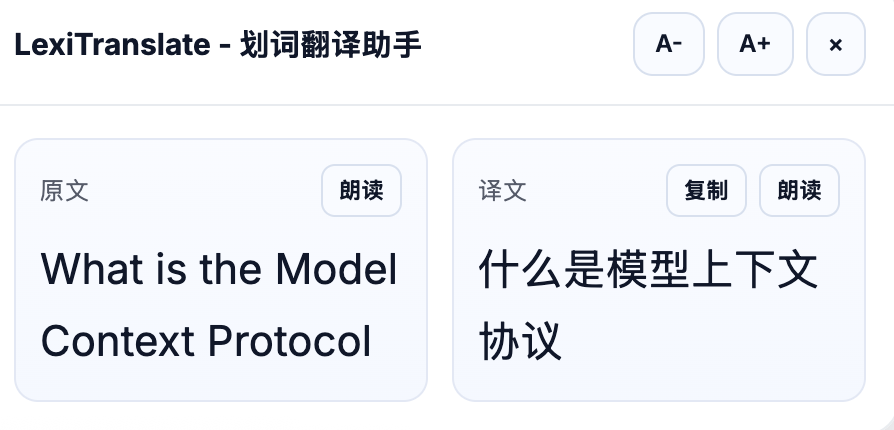
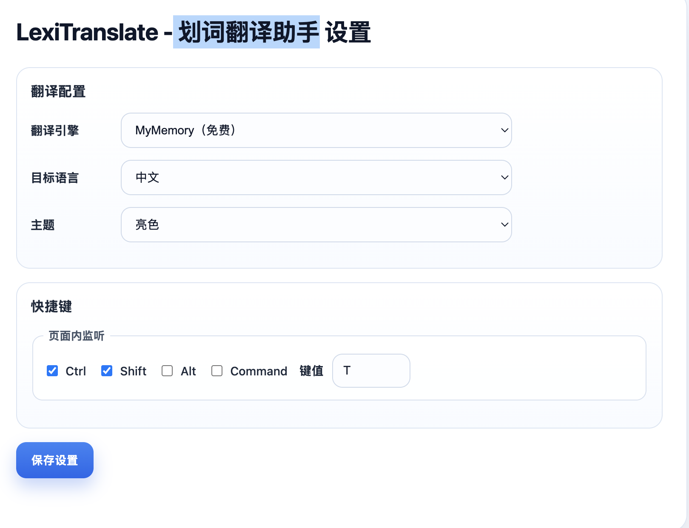

# LexiTranslate - 划词翻译助手

LexiTranslate 是一款面向中文用户的 Chrome 划词翻译插件。  
你只需在网页中选中文本，即可一键翻译、朗读与复制，适合阅读外文网页、技术文档和学习资料。

## 主要功能

- 划词即用：选中文本后显示快捷工具条（翻译 / 朗读）
- 即时翻译：支持最多 500 字符的快速翻译
- 多引擎切换：支持 `MyMemory` 与 `LibreTranslate`
- 自动回退：主引擎异常时自动切换备用引擎
- 多语言支持：中文、英语、日语、韩语、法语、西班牙语
- 双栏弹窗：原文与译文并排展示
- 朗读与复制：支持原文/译文朗读与译文复制
- 自定义设置：目标语言、主题、快捷键可配置

## 安装方式（开发者模式）

1. 打开 Chrome，访问 `chrome://extensions/`
2. 打开右上角“开发者模式”
3. 点击“加载已解压的扩展程序”
4. 选择本项目根目录

## 使用说明

1. 在任意网页选中一段文字
2. 点击浮动工具条中的“翻译”按钮（或使用快捷键）
3. 在翻译面板查看结果，可执行复制、朗读、字号调整
4. 在设置页中调整翻译引擎、目标语言、主题与快捷键

默认快捷键：
- Windows / Linux：`Ctrl + Shift + T`
- macOS：`Command + Shift + T`

## 界面示意图

截图位于 `docs/images/`。

### 划词翻译浮窗





### 设置页面



## 发布到 Chrome 网上应用店

1. 打包为 zip 时建议**只包含**运行所需文件：`manifest.json`、`icons/`、`src/`（勿将 `demo.html`、`package.json`、`scripts/` 等开发文件打进上架包，除非你有意开源完整仓库）。
2. 商店后台的**简短说明 / 详细说明 / 权限说明**可参考 [`docs/STORE_LISTING.md`](docs/STORE_LISTING.md)。
3. 上架需提供**隐私政策 URL**：可将 [`docs/PRIVACY.md`](docs/PRIVACY.md) 发布为公开网页（如 GitHub Pages）后填写链接。
4. 若默认快捷键与其他扩展冲突，可在 `chrome://extensions/shortcuts` 中修改。

## 隐私说明

- 插件仅处理你主动选中的文本内容
- 翻译请求会发送到你选择的第三方翻译服务
- 插件不采集浏览历史，不要求登录账号
- 本地仅保存你的个性化设置（如主题、目标语言、快捷键）

## 项目结构

- `manifest.json`：Chrome 扩展配置（Manifest V3）
- `icons/`：扩展图标（16 / 32 / 48 / 128）
- `src/content.js`：划词交互、翻译面板与页面内行为
- `src/translation.js`：翻译引擎调用、回退与结果校验
- `src/settings.js`：配置读取与存储
- `src/options/`：设置页面
- `src/styles/content.css`：页面注入样式

## 本地测试

```bash
npm test
```

测试内容包括：
- `manifest.json` 关键字段完整性
- 关键脚本/样式/设置页文件存在性
- 内容脚本注入配置正确性
